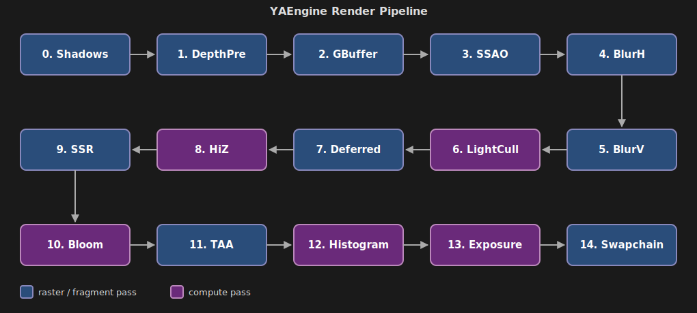

# YAEngine

Real-time 3D rendering engine implemented with Vulkan API. C++23, Windows.

<iframe width="560" height="315" src="https://www.youtube.com/embed/9NUcyKXAWYY?si=H2C4lIFqVgdVD9wY" title="YAEngine" frameborder="0" allow="accelerometer; autoplay; clipboard-write; encrypted-media; gyroscope; picture-in-picture; web-share" referrerpolicy="strict-origin-when-cross-origin" allowfullscreen></iframe>

## Build & Run

Prerequisites:
- **Vulkan SDK** (restart the machine after install so `VULKAN_SDK` is exported)
- **MSVC** (Visual Studio 2022+)
- **CMake** 3.10+

Build:

```bash
# Editor build - recommended for a first run
cmake -B cmake-build-debugeditor -DCMAKE_BUILD_TYPE=Debug -DYA_EDITOR=ON -G "NMake Makefiles"
cmake --build cmake-build-debugeditor --target RacingDemo
```

Build profiles:

| Profile     | CMake flags                                    | What you get               |
|-------------|------------------------------------------------|----------------------------|
| Debug       | `-DCMAKE_BUILD_TYPE=Debug`                     | Engine runtime, no editor  |
| DebugEditor | `-DCMAKE_BUILD_TYPE=Debug -DYA_EDITOR=ON`      | Everything + editor UI     |
| Release     | `-DCMAKE_BUILD_TYPE=Release`                   | Optimized, no editor       |

The `YA_EDITOR` flag toggles editor layer. All editor code is `#ifdef`-guarded out of production builds.

## Graphics Features

- **Deferred PBR.** Cook-Torrance, metallic/roughness.

- **Transparent forward.** Post-TAA, shares deferred lighting/IBL.

- **Shadows.** CSM (directional) + cube (4 point) + spot, shared 8192х8192 atlas.

- **Tile-based light culling.** 16х16 tiles, compute pass writes per-tile light list.

- **IBL + light probes.** GPU-baked: cubemap, irradiance convolution, roughness-prefiltered specular.

**Screen-space effects:**
- **SSAO** - bilateral blur
- **SSR** - Hi-Z ray marching
- **TAA** - Halton jitter + variance clipping
- **Bloom** - 6-mip dual-filter
- **Auto exposure** - GPU histogram
- **Height fog** - distance + altitude falloff
- **Tonemapping** - ACES or AgX



## Architecture & Optimization

The goal was to keep the renderer declarative at the pass level and keep the engine flexible enough to add features without rewrites. Notable pieces:

- **Render graph.** Declarative passes; auto-allocates transient images, render passes, framebuffers, barriers.

- **Draw command sorting.** 3-level key (pipeline > material > mesh), shared by GBuffer, depth prepass, shadows.

- **Shared C++/GLSL headers.** UBO layouts defined once, used on both sides.

- **Asset system.** Generational slot maps + typed handles (mismatched handle = compile error).

- **Async asset loading.** Model import, texture decode, IBL bake on thread pool; main thread only does Vulkan uploads.

- **ECS.** `entt` storage + custom `SystemScheduler` + dirty-flag transform propagation.

- **Scene serialization.** YAML + type-erased `ComponentRegistry`, new components self-register.

- **Shader hot-reload (editor).** File watcher + include dependency graph; rebuilds only affected pipelines on a worker thread, never blocks the frame.

- **Editor.** Dockable ImGui, 3D gizmos as render-graph passes, offscreen viewport.

- **Build system.** CMake + NMake. Custom shader compiler handles `#include`, shared C++/GLSL headers, pipeline permutations.
