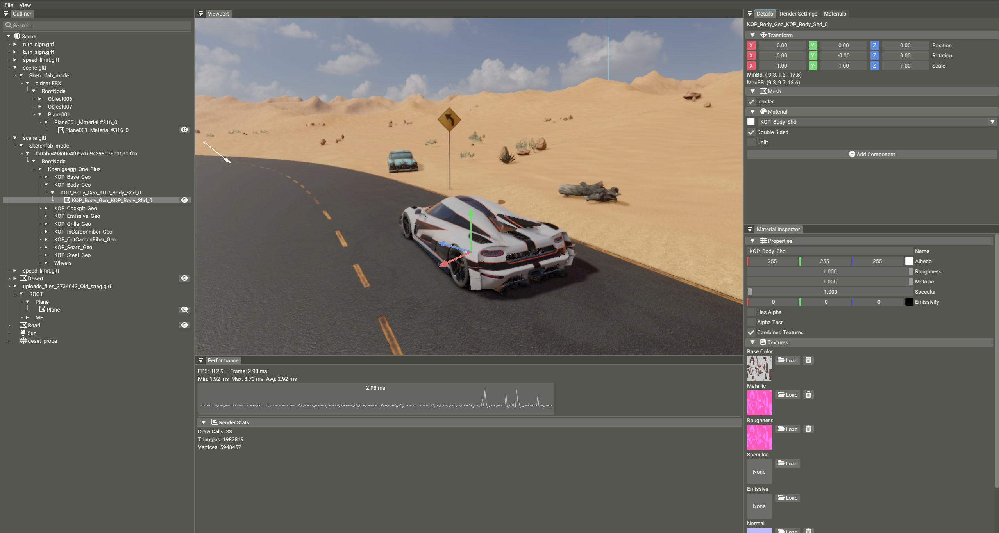

# YAEngine

Real-time 3D rendering engine implemented with Vulkan API. C++23, Windows.



## Build & Run

Prerequisites:
- **Vulkan SDK** (restart the machine after install so `VULKAN_SDK` is exported)
- **MSVC** (Visual Studio 2022+)
- **CMake** 3.10+

Build:

```bash
# Editor build - recommended for a first run
cmake -B cmake-build-debugeditor -DCMAKE_BUILD_TYPE=Debug -DYA_EDITOR=ON -G "NMake Makefiles"
cmake --build cmake-build-debugeditor --target RacingDemo
```

Build profiles:

| Profile     | CMake flags                                    | What you get               |
|-------------|------------------------------------------------|----------------------------|
| Debug       | `-DCMAKE_BUILD_TYPE=Debug`                     | Engine runtime, no editor  |
| DebugEditor | `-DCMAKE_BUILD_TYPE=Debug -DYA_EDITOR=ON`      | Everything + editor UI     |
| Release     | `-DCMAKE_BUILD_TYPE=Release`                   | Optimized, no editor       |

The `YA_EDITOR` flag toggles editor layer. All editor code is `#ifdef`-guarded out of production builds.

## Graphics Features

- **Deferred PBR.** Cook-Torrance BRDF, metallic/roughness workflow.

- **Shadows.** CSM for the directional light, cube shadows for up to four point lights, standard spot shadows. All of them share one 8192x8192 atlas.

- **Tile-based light culling.** Compute pass divides the screen into 16x16 tiles and writes a per-tile light index list.

- **IBL + light probes.** Engine generates the full IBL set on the GPU: cubemap, irradiance convolution, roughness-prefiltered specular.

**Screen-space effects:**
- **SSAO** - bilateral blur
- **SSR** - Hi-Z ray marching
- **TAA** - Halton jitter + variance clipping
- **Bloom** - 6-mip dual-filter
- **Auto exposure** - GPU histogram
- **Exponential height fog** - distance + altitude falloff
- **Tonemapping** - ACES and AgX

## Architecture & Optimization

The goal was to keep the renderer declarative at the pass level and keep the engine flexible enough to add features without rewrites. Notable pieces:

- **Render graph.** Passes are declared once with their inputs and outputs; the graph allocates transient images, builds render passes and framebuffers, and inserts Vulkan barriers on its own.

- **Draw command sorting.** Three-level sort key: pipeline variant > material > mesh. Same sort runs through GBuffer, depth prepass and shadow passes.

- **Shared C++/GLSL headers.** UBO layouts are defined once - the struct the CPU fills is the struct the GPU reads, no two-sided maintenance.

- **Asset system.** Generational slot maps with typed handles - passing a `MeshHandle` where a `TextureHandle` is expected won't compile.

- **Async asset loading.** Model imports, texture decoding and IBL generation run on a thread pool; the main thread only picks up the final Vulkan uploads.

- **ECS.** `entt` for storage, a custom `SystemScheduler` for ordering, dirty-flag transform propagation - only changed subtrees are reprocessed each frame.

- **Scene serialization.** YAML via a type-erased `ComponentRegistry` - adding a new serializable component doesn't require touching the serializer.

- **Shader hot-reload (editor).** File watcher + dependency graph: a changed `.glsl` include triggers recompilation of every shader that pulls it in, and the pipeline cache rebuilds only affected pipelines. Runs on a worker thread, the frame loop never blocks.

- **Editor.** Dockable ImGui panels, custom 3D gizmos rendered through their own render-graph passes, offscreen viewport whose resolution is independent of the window.

- **Build system.** CMake + NMake (single-config, clean CI). Custom shader compiler handles `#include` resolution, shared C++/GLSL headers and pipeline permutations.
